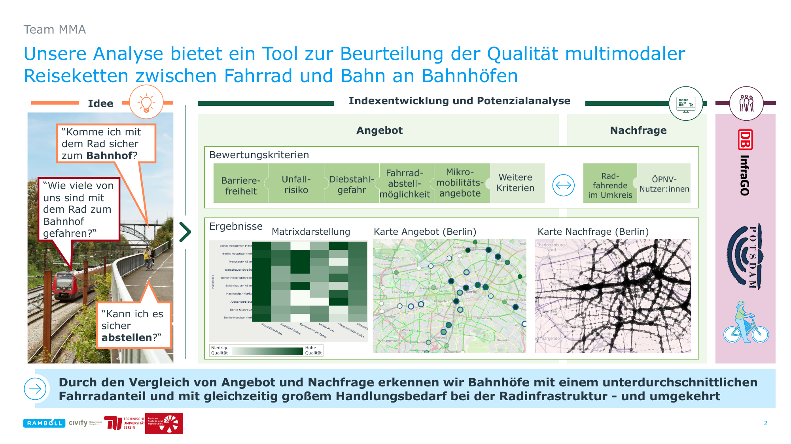

# Rad-Bahnhof-Index-Karte
MMA ist eine Methode und ein Tool zur Beurteilung der Qualität multimodaler Reiseketten zwischen Fahrrad und Bahn an Bahnhöfen. Fahrräder sind tolle Verkehrsmittel, um von und zu Bahnhöfen reisen zu können. Sie helfen dabei, die erste und letzte Meile eines Weges schneller zu überbrücken und machen aktive sowie öffentliche Verkehre attraktiver. So leistet sie einen wichtigen Beitrag zur Mobilitätswende und zur Verringerung von CO2-Emissionen.

Allerdings ist Fahrradfahren hin und von Bahnhöfen nicht einwandfrei: ein chaotisches Bahnhofsumfeld mit viel Autoverkehr und unsichere Fahrradinfrastruktur, unsichere oder überfüllte Radabstellplätze, fehlende oder kaputte Aufzüge hindern gerade diese Rad+ÖPNV-Wege. Multimodales Reisen kann besser! In der Wissenschaft ist dies schon länger bekannt und auch in der öffentlichen Hand erscheint diese Vision zunehmend selbstverständlich. Die EU-Kommission hat in ihrem Forschungsprogramm Horizon Europe und Ziel festgesetzt:

**Multimodal and sustainable transport systems for passengers and goods**:
> Enhanced resilience of transport networks through improved operational efficiency for both passenger and intermodal freight transport, future-proofed mobility systems supporting EU competitiveness while ensuring affordable and accessible transport for all passengers.

Doch wo fangen wir an umzusetzen - welche Daten und Informationen gibt es zu diesem Zweck, und welche brauchen wir eigentlich, damit ein Weg mit Rad und Bahn genau die richtige Art von Abenteuer ist?

MMA bietet Einsichte in konkrete Daten und Kriterien, um Radtauglichkeit von Bahnhöfen zu beurteilen und visualisiert diese. 
MMA wirkt dabei in zwei Richtungen:
1.	Für User bietet sie Infos dazu, wie bequem die Multimodalität mit dem Rad für ein Bahnhof ist, u.a. durch Infos über:
  a.	Verfügbarkeit von Radstellplätze
  b.	Verfügbarkeit von Aufzügen
  c.	Verkehrssicherheit im Bahnhofsumfeld
2.	Für Planung bietet sie gleichzeitig ein starkes Kommunikationstool und eine Checkliste, um Bahnhöfe noch radtauglicher zu machen.

Ein Prototyp wurde entwickelt beim Rad-Daten-Hackathon im November 2025 in Potsdam, mit Unterstützung von DB InfraGO, die Landeshauptstadt Potsdam (Urbane Datenplatfform, Smart City sowie Radverkehrsplanung) und das Potsdam Lab.

Zum jetzigen Zeitpunkt ist MMA als statisches Web-App abrufbar. Wir haben viele Ideen zur Weiterentwicklung, und freuen uns über Unterstützung jeglicher Art bei der Weiterentwicklung!

## Formel zur Indexberechnung

Der Index wird einfache Prozentrechnung wie folgt berechnet:

${\color{teal}I}$ - Index, ${\color{gray}x}$ - Datenpunkt, ${\color{green}M}$ - maximaler Wert der Datenreihe

$$ {\color{teal}I} = \frac{{\color{gray}x}}{{\color{green}M}} .$$

Der Indexwert $I$ liegt zwischen $[0, 1]$, d.h. von $0$ bis $100$ Prozent. Maximalwert $1$ ist der Optimalwert und Minimalwert $0$ ist der schlechteste Wert. Bei Datenreihen, wo der maximale Wert, von der Interpretation her der schlechteste ist, haben wir die Datenpunkte umgekehrt berechnet:

$$ {\color{teal}I} = \frac{({\color{green}M}-{\color{gray}x})}{{\color{green}M}} .$$

Das ${\color{green}M}$ - maximaler Wert der Datenreihe, sollte dann ersetzt werden mit einer Kombination aus Nachfrage und Angebot der Bahnhöfe. Zum Schluss wurde dann der Gesamtindex durch eine Mittelwertberechnung ermittelt:

${\color{teal}I}_{\color{red}k}$ - Indizes, ${\color{green}N}_{\color{red}I}$ - Gesamtanzahl an Indizes, 

$$ I_G = \frac{(I_1 + I_2 + ... I_N)}{N_I} .$$

Der Gesamtindex $I_G$ sollte dann später gewichtet werden nach bestimmten Kriterien mit den Gewichtungsfaktoren:

$g_k$ - Gewichtungsfaktoren

$$ I_G = \frac{(I_{1}g_1 + I_{2}g_2 + ... I_{N}g_N)}{N_I} $$

mit

$$ g_1 + g_2 + ... g_N = 1 .$$

## Visualisierung
Mehr zu unserer Idee:

Die Karte:

